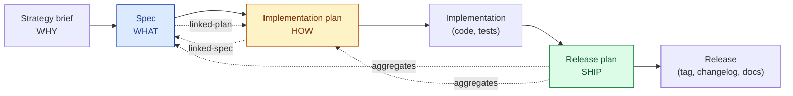
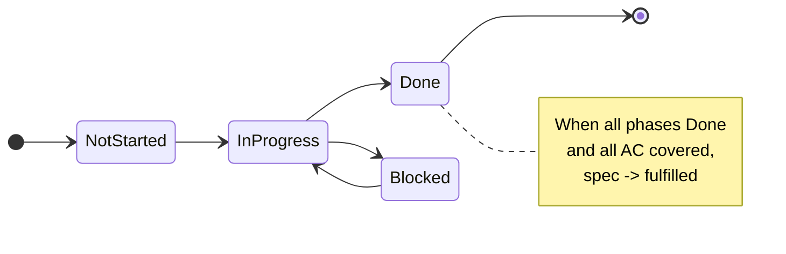
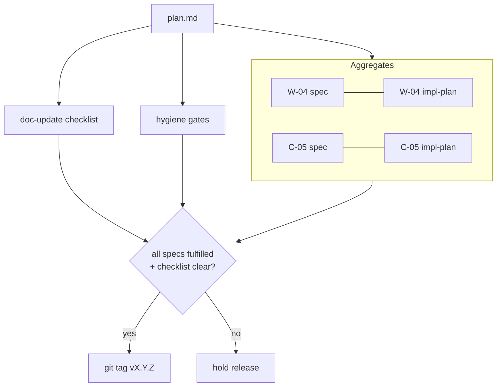
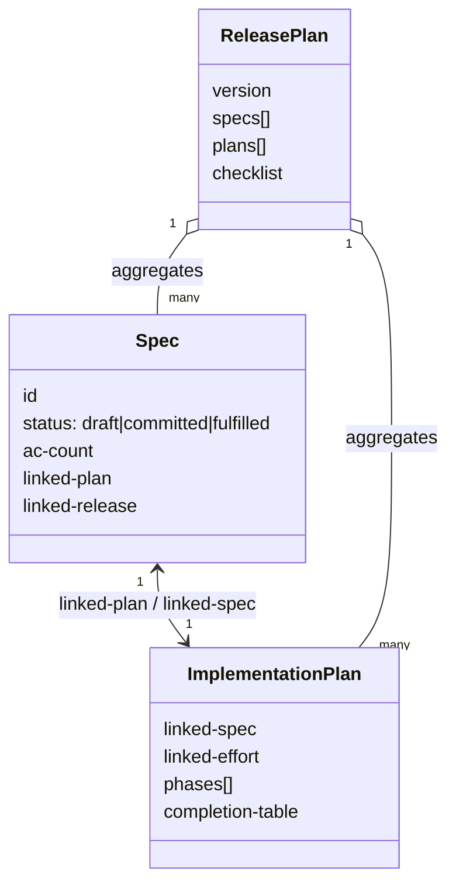

# Planning Artifact Model

How three documents - the **spec**, the **implementation plan**, and the **release plan** - divide the work of going from "we decided to build this" to "this shipped." This is the reference that `/plab-spec`, the implementation-plan template, and `/plab-release-plan` are built against, and it is cited by name from both `skills/plab-spec/SKILL.md` and `skills/plab-init-project/references/folder-spine.md`.

> **Provenance.** This document was written in `jp-library` between 2026-05-27 and 2026-06-17 and recovered into this repository on 2026-09-11, because two shipped skills here cite it four times and it had never been migrated. The three decisions in section 9 are the originals and their dates are unchanged; what was amended on recovery is every path, name and layout that described `jp-library` rather than this repository. Those amendments are listed in the recovery note at the end.

> **One stage is a template here, not a skill.** The original model paired each stage with a skill, including `/jp-implementation-plan` for the HOW stage. **This repository has no implementation-plan skill and is not waiting for one.** The HOW stage is served by `docs/internal/release-plans/implementation-plan-template.md`, distilled from sixteen implementation plans that were written with no plan-authoring skill involved and shipped through every hygiene gate. Wherever the original named that skill, this copy names the template.

---

## 1. The chain at a glance

| Artifact | Question it answers | Owns | Lifespan | Scope | Skill |
|----------|--------------------|------|----------|-------|-------|
| Strategy brief | WHY / should we | Problem framing, options, recommendation | Discarded once committed | One problem | `/plab-strategy-brief` |
| **Spec** | WHAT | Acceptance criteria, scope, sources | Stable; survives plan rewrites | One feature | `/plab-spec` |
| **Implementation plan** | HOW | Phases, file-level steps, completion status | Dynamic; rewritten as work proceeds | One spec | `implementation-plan-template.md` |
| **Release plan** | SHIP | Aggregated specs + plans, doc-update checklist | Per-version | One release | `/plab-release-plan` |

The load-bearing idea: **WHAT is stable, HOW is dynamic, SHIP is an aggregation.** A spec is a contract you can point back to ("the AC were always X"); the plan beneath it can be torn up and rewritten without touching that contract; the release plan gathers many spec+plan pairs into one shippable unit.



---

## 2. Spec (WHAT)

The requirements contract for one feature. Produced by `/plab-spec`. Storage uses a per-effort folder so the spec, plan, and any supporting material for one effort travel together:

- **With target release:** `docs/internal/release-plans/plan_NN_<slug>/<id>_<slug>/spec.md`
- **Without target release yet:** `docs/internal/release-plans/_unassigned/<id>_<slug>/spec.md`

The whole effort folder moves from `_unassigned/` into `plan_NN_<slug>/` when the target release is committed (D1 implementation detail). The move is performed by `/plab-release-plan --promote`, and `--demote` reverses it.

**What it owns**

- Numbered acceptance criteria (AC), each cited to a source
- In-scope / non-goals
- A Task Summary block at the top that downstream agents update without rewriting the body
- Append-only revision history (a committed AC is never silently rewritten)

**Status lifecycle:** `draft -> committed -> fulfilled` (or `superseded`). Promotion to `committed` is a human action; AC become contract at that point.

The spec deliberately does **not** contain implementation steps. "How" lives in the plan.

---

## 3. Implementation plan (HOW)

The executable decomposition of one committed spec. Written against `docs/internal/release-plans/implementation-plan-template.md` and stored in the same per-effort folder as its spec:

- **With target release:** `docs/internal/release-plans/plan_NN_<slug>/<id>_<slug>/implementation-plan.md`
- **Without target release yet:** `docs/internal/release-plans/_unassigned/<id>_<slug>/implementation-plan.md`

The effort folder (containing both `spec.md` and `implementation-plan.md`, plus any optional `supporting/` material) moves as a unit when the target release is committed.

**What it owns**

- A **completion-status summary table at the very top** (new requirement, see below)
- Numbered phases, each with: goal, file-level steps, verification, decision gate, output artifacts, suggested owner
- An explicit map from each phase to the spec AC it fulfills (every spec AC is addressed by at least one phase)
- Round-trip links: the plan carries `linked-spec`; on creation it sets the spec's `linked-plan`

**What it refuses to do**

- Invent acceptance criteria. AC belong in the spec. If you try to add an AC here, the skill redirects you to `/plab-spec --revise`.
- Stay abstract. "Update the SKILL.md" is rejected by a lint; "Update `skills/foo/SKILL.md` frontmatter `version` to `1.1.0`" is accepted.

### 3.1 The completion-status summary table

Every implementation plan opens with a single table that is the at-a-glance dashboard of the whole plan. An agent updates one cell when it finishes a phase; a human reads one table to know where things stand.

| Phase | Goal | Fulfills AC | Owner | Status |
|-------|------|-------------|-------|--------|
| P1 | Scaffold module + tests | AC-1, AC-2 | LLM | Done |
| P2 | Wire the parser | AC-3 | LLM | In progress |
| P3 | Error paths + redirects | AC-6, AC-7 | either | Not started |
| P4 | Quality gates + docs | AC-4, AC-8 | human | Blocked |

Status vocabulary: `Not started` | `In progress` | `Done` | `Blocked`. The plan is "complete" when every row is `Done` **and** every spec AC appears in at least one `Done` row - which is exactly the spec's definition of done. That coupling is what lets the spec flip to `fulfilled` on evidence rather than by hand.



---

## 4. Release plan (SHIP)

The version-scoped aggregation: everything needed to ship a release. Produced by `/plab-release-plan`.

**Layout**

```
docs/internal/release-plans/
├── plan_07_aggregation/                           # release folder, self-contained
│   ├── plan.md                                    # the release plan document
│   ├── W-04_digest-mode/                          # per-effort folder, peer to plan.md
│   │   ├── spec.md
│   │   ├── implementation-plan.md
│   │   └── supporting/                            # optional, per-effort research / attachments
│   └── C-05_arc-resume/
│       ├── spec.md
│       └── implementation-plan.md
├── _unassigned/                                   # pre-release home, same per-effort shape
│   └── A-02_programmatic-review-dispatch/
│       └── spec.md
├── implementation-plan-template.md                # the HOW stage, a template rather than a skill
├── INDEX.md                                       # generated cross-release index, never hand-edited
├── README.md                                      # conventions, effort IDs and the series legend
└── release-checklist.yaml                         # optional, project-level checklist extensions
```

**Folder naming, as built here.** The release folder is `plan_NN_<slug>`, a sequence number and a handle, and the plan document inside it is always `plan.md`. The original model named both after the version (`plan_v1.4.0/plan_v1.4.0.md`); this repository decoupled them, because a release folder is scoped before its version number is known and renaming a folder at tag time would break every citation into it. The version lives in the plan document's frontmatter, not in the path.

Per D1, the release folder is not a view onto specs that live elsewhere - the specs and plans are *born here*. The release becomes the closure boundary: when the release ships, every artifact under its folder freezes together. The release plan document sits at the top of its own folder, alongside the per-effort folders it aggregates. The doc-update checklist lives inline in that `plan.md` (not a subfolder).

**What the plan document owns**

- An aggregation table: every spec in the release, its coupled implementation plan, and the rolled-up status of each
- Hygiene gates (e.g., note collection complete before any spec is committed)
- A **release doc-update checklist** that must be cleared before tagging:

| Doc | Update | Done |
|-----|--------|------|
| `CHANGELOG.md` | Move items from Unreleased to the version section | [ ] |
| `README.md` | Bump any version references / capability list | [ ] |
| `AGENTS.md` | Reflect new or renamed skills | [ ] |
| `docs/skills/README.md` | Sync per-skill version table | [ ] |
| `skills/*/HISTORY.md` | Append the version's changes | [ ] |
| `library.json` | Bump the plugin version in the canonical manifest | [ ] |
| `.claude-plugin/plugin.json`, `.codex-plugin/plugin.json` | **Regenerate, never hand-edit.** Both are generated from `library.json` | [ ] |
| `skills/*/SKILL.md` | Bump per-skill `metadata.version` frontmatter | [ ] |
| Git tag | `vX.Y.Z` after all of the above | [ ] |



---

## 5. How they interact

### 5.1 Linking model

Links are bidirectional and resolve to files on disk. This is what lets any agent traverse the chain cold.



### 5.2 Status propagation

Status flows **up** the chain from evidence, never down by assertion:

1. An agent marks a plan phase `Done` in the completion table.
2. When every phase is `Done` and every AC is covered, the plan signals the spec can move to `fulfilled`.
3. When every spec in a release is `fulfilled` and the doc-update checklist is clear, the release plan unblocks the tag.

The release plan never marks a spec fulfilled itself; it only reads the state. This keeps a single source of truth per level.

---

## 6. Cross-cutting conventions these three share

### 6.1 The questions / decisions section standard

Any section in any of these documents that captures open questions or decisions uses one format, so a human always knows where to look and where to respond. (This document dogfoods it in section 9.)

The canonical definition is `references/decisions-section.md`. In brief: a summary table (`ID | Title | Resolution | Status | Updated`), a per-item subsection whose header carries the status (Summary, Context, Desired outcome, Options / approaches, Recommendation), and a visually separated maintainer decision block. See that file for the full structure, status vocabulary, and lifecycle rules.

### 6.2 Unified, GitHub-compatible frontmatter

All outputted documents share one frontmatter shape so GitHub renders it as a clean table and downstream parsers stay simple:

- Valid YAML at the very top of the file, delimited by `---`.
- Strings containing a colon are quoted; dates are ISO `YYYY-MM-DD`; lists use block (`-`) style.
- Common keys across artifact types: `title`, `type`, `status`, `created`, `updated`, plus type-specific keys (`id`, `ac-count`, `linked-*`, `version`).
- `type` is the discriminator (`spec`, `implementation-plan`, `release-plan`, `session-log`, `reference`).

### 6.3 Output paths

- Spec + implementation plan (target release assigned): `docs/internal/release-plans/plan_NN_<slug>/<id>_<slug>/{spec.md,implementation-plan.md}`
- Spec + implementation plan (target release not yet assigned): `docs/internal/release-plans/_unassigned/<id>_<slug>/{spec.md,implementation-plan.md}`
- Release plan document: `docs/internal/release-plans/plan_NN_<slug>/plan.md`
- Skill-generated deliverables for end users: `_output/<skill-name>/`, which is gitignored

---

## 7. How each artifact can be improved

### Spec

- Replace the flat numbered "Open Questions" list with the section-6.1 decisions standard.
- Drive `status: fulfilled` from the coupled plan's completion table instead of a manual edit.
- Add a `linked-release` field so a spec knows which release ships it.

### Implementation plan

- Ship the completion-status summary table (section 3.1) as a hard structural requirement, not an option.
- Make AC coverage a lint: refuse to finalize a plan that leaves a spec AC unmapped to any phase.
- Restate the spec's AC verbatim as the plan's Definition of Done checklist, so "done" is auditable against the contract.
- Surface a staleness banner in the summary table when the spec was edited after the plan's `updated` date.

### Release plan

- Decide link-vs-copy for the complementary folder (open question D1 below) and enforce it.
- Auto-generate the aggregation table from the efforts it references rather than hand-maintaining it.
- Treat the doc-update checklist as a gate, not a reminder: no tag until every box is checked.

---

## 8. Comparison with other libraries

### Superpowers (`writing-plans` + `executing-plans`)

Superpowers **collapses** what this model separates. `writing-plans` goes straight from requirements to code-level tasks (2-5 minute steps, exact file paths, complete code, TDD baked in) in a single artifact; `executing-plans` runs that artifact in later sessions with review checkpoints.

| Dimension | This library | Superpowers |
|-----------|-----------|-------------|
| WHAT vs HOW | Separated (spec vs plan) | Merged into one plan |
| AC traceability | Each AC cited to a source | No citation discipline |
| Task granularity | Phase-level, file-path detail | 2-5 min steps with full code |
| Cross-session execution | Plan + session log + `/plab-continue-session`, which shipped | `executing-plans` handles it directly |
| Release aggregation | `/plab-release-plan` (version-scoped) | No equivalent |

Trade-off: superpowers is faster for solo work because it skips the spec ceremony; this library's separation pays off when work spans sessions or reviewers and you need to point at a stable contract.

> **Status note, added on recovery 2026-09-11.** This comparison was written while superpowers was installed, and it was accurate then. It is kept as written rather than rewritten, because a dated comparison is evidence. What changed since: the superpowers plugin was disabled in this repository on 2026-09-10 as a reversible experiment, and the discipline rules it supplied now live in the `## Engineering discipline` section of `AGENTS.md`. The experiment, its four pre-registered reinstall signals and its verdict rule are recorded outside the tracked tree; the summary that matters here is that `writing-plans` authored none of the sixteen tracked implementation plans, so the stage it covered was already being served by the template this document points at.

### Anthropic's first-party skill collection

Anthropic's collection (docx, pptx, pdf, xlsx, canvas-design, brand-guidelines, `doc-coauthoring`, `skill-creator`, `mcp-builder`, `frontend-design`, `internal-comms`, ...) is **artifact- and format-production focused**. There is no spec -> plan -> release lifecycle skill among them. The nearest neighbors are `doc-coauthoring` (a structured doc-writing workflow, but not a requirements contract) and `skill-creator` (authoring skills, not planning features). So for this problem space, Anthropic's collection offers no direct competitor; the meaningful comparison is superpowers.

### Adjacent points of reference

- **claude-mem `make-plan` / `do`:** a phased plan plus a subagent executor - closest in spirit to the implementation-plan template plus execution, but without the spec/AC contract or release aggregation.
- **pm-skills (your own repo):** `prd`, `adr`, `release-notes`, `launch-checklist` overlap at the edges. `prd` is a heavier WHAT than a spec; `launch-checklist` overlaps the release plan's doc-update checklist. Worth mining for the release-plan checklist content rather than reinventing it.

---

## 9. Open Questions / Decisions

Uses the standard in `references/decisions-section.md`.

| ID | Title | Resolution | Status | Updated |
|----|-------|------------|--------|---------|
| D1 | Copy vs link in the release complementary folder | Release-folder-primary (folder is the canonical home, not a view onto /efforts/) | Decided | 2026-05-28 |
| D2 | One plan per spec, or one plan for several specs? | Default 1:1; allow many:1 via `linked-specs` list | Decided | 2026-05-28 |
| D3 | Where AC-fulfillment evidence lives | Plan owns progress; spec owns the AC themselves | Decided | 2026-05-28 |

### D1: Copy vs link in the release complementary folder

**Summary.** The release folder `v1.4.0/` is meant to "contain" specs and implementation plans, but those already live at `docs/internal/efforts/<id>/`.

**Context.** Copying duplicates content and creates drift (two copies of one spec disagreeing). Linking keeps one source of truth but makes the release folder less self-contained if efforts are later moved or archived.

**Desired outcome.** A release folder that is both a faithful snapshot and free of drift.

**Options / approaches.**
- *Link-only:* the folder holds relative links (or a manifest) to `efforts/<id>/`. One source of truth; zero drift; release folder depends on efforts staying put.
- *Copy-at-tag:* efforts stay the working home; at release tag time, the specs/plans are copied in as a frozen snapshot. Self-contained and immutable, but a point-in-time fork.
- *Hybrid:* link during the in-progress release; copy as a frozen snapshot only at tag.

**Agent recommendation.** Hybrid. Link while the release is in progress (the efforts are the live source), then snapshot-copy at tag time so the released version is immutable and self-contained. This matches how the rest of the chain treats "committed" as a freeze point.

---

> **Maintainer decision:** Decided 2026-05-28 by jp
>
> * **Status:** Decided
> * **Choice:** Release-folder-primary. Specs and implementation plans live in the release folder (`docs/internal/release-plans/plan_vX.Y.Z/specs/` and `.../implementation-plans/`), not in `docs/internal/efforts/`. The release folder is the canonical home for all artifacts within scope of a release. This goes beyond the agent's "hybrid" option, which still treated `/efforts/` as the live home.
> * **Reasoning:** The existing `docs/internal/efforts/` folder grows without closure; items rarely get marked done, so the folder is noisy and the signal of "what's actively in scope" is lost. Tying specs and plans to a release makes the release the unit of closure: when the release ships, all its artifacts freeze together as a coherent unit. Closure is enforced by the lifecycle rather than by manual hygiene.
> * **Decided by / date:** jp / 2026-05-28
>
> **Implementation details (resolved 2026-05-28):**
>
> * **Unassigned specs/plans:** target-release is *not* required at spec creation. Pre-release artifacts live at `docs/internal/release-plans/_unassigned/specs/<id>_spec.md` and `_unassigned/implementation-plans/<id>_<slug>_implementation-plan.md`. Same sub-structure as a real release, so promotion is a folder-to-folder move with no rename. The mandatory move *is* the release assignment.
> * **Effort briefs at `/efforts/<id>.md`:** deferred. A planned rework of issue/effort tracking will resolve their fate. For now, existing effort briefs stay in place; new work does not require an effort brief to create a spec.
> * **Migration of existing specs at `/efforts/<id>/`:** leave alone. The release-folder convention applies to *new* specs only. Existing specs stay where they are until the effort-tracking rework addresses them.

**As built in this repository. Added on recovery, 2026-09-11. The decision above is unchanged; three of its implementation notes describe a layout that was superseded before this repository adopted it, and are recorded here rather than edited above, because a decided record is append-only.**

| What D1 says | What this repository does | Why it differs |
|---|---|---|
| Release folder `plan_vX.Y.Z/`, document `plan_vX.Y.Z.md` | Folder `plan_NN_<slug>/`, document `plan.md` | A release folder is scoped before its version is known. Naming it after the version would force a rename at tag time and break every citation into it. The version lives in the plan document's frontmatter. |
| Specs at `plan_vX.Y.Z/specs/<id>_spec.md`, plans at `.../implementation-plans/<id>_<slug>_implementation-plan.md` | Both inside one per-effort folder: `plan_NN_<slug>/<id>_<slug>/{spec.md,implementation-plan.md}` | The flat split put a spec and its own plan in different directories, so promotion moved two files from two places and nothing kept them together. The per-effort folder makes the effort the unit that moves, which is what `--promote` and `--demote` operate on. |
| Unassigned at `_unassigned/specs/` and `_unassigned/implementation-plans/` | `_unassigned/<id>_<slug>/`, the same per-effort shape as a release folder | Follows from the row above. D1's stated intent - "same sub-structure as a real release, so promotion is a folder-to-folder move with no rename" - is preserved exactly; only the sub-structure it is the same *as* changed. |

**The decision itself survives all three.** D1 ruled that the release folder is the canonical home for specs and plans rather than a view onto `docs/internal/efforts/`, and that is what this repository does: `docs/internal/efforts/` does not exist here. Sections 2, 3 and 6.3 of this document were already written against the per-effort layout; only D1's implementation notes lagged, which is how the drift stayed invisible until recovery.

### D2: One plan per spec, or one plan for several specs?

**Summary.** The current model assumes a 1:1 spec-to-implementation-plan coupling.

**Context.** Some releases bundle several small specs that share one implementation effort. Forcing 1:1 may create thin, redundant plans; allowing many:1 complicates the AC-coverage lint and the round-trip links.

**Desired outcome.** A coupling rule that handles both a large feature and a cluster of small related ones without contorting the link model.

**Options / approaches.**
- *Strict 1:1:* simplest links and lint; more files for small work.
- *Many specs : 1 plan:* the plan carries `linked-specs` (list); the completion table's "Fulfills AC" column namespaces AC by spec id (e.g., `S-07/AC-3`).

**Agent recommendation.** Default 1:1, allow many:1 via a `linked-specs` list. Keep the simple case simple; permit the bundle when it is genuinely one effort.

---

> **Maintainer decision:** Decided 2026-05-28 by jp
>
> * **Status:** Decided
> * **Choice:** Default 1:1 spec-to-implementation-plan; allow many:1 via `linked-specs` list when one plan delivers a small cluster of related specs.
> * **Reasoning:** Agreed with agent recommendation. Keeps the common case simple while supporting the bundle case via a single optional field.
> * **Decided by / date:** jp / 2026-05-28

### D3: Where does AC-fulfillment evidence live?

**Summary.** Both the spec's Task Summary ("Acceptance Criteria Fulfillment" checklist) and the plan's completion table track AC status. Two homes invites disagreement.

**Context.** The spec is the contract; the plan is where work actually happens. If both track AC, which one is authoritative?

**Desired outcome.** One authoritative source, with the other view derived or clearly secondary.

**Options / approaches.**
- *Plan is authoritative:* the plan's completion table is the source of truth; the spec's checklist is a generated mirror.
- *Spec is authoritative:* the spec's checklist is source of truth; the plan references it.

**Agent recommendation.** Plan is authoritative for *progress*; spec is authoritative for *the AC themselves*. The plan tracks "is AC-3 done" (work state); the spec defines "what AC-3 is" (contract). The spec's fulfillment checklist becomes a read-only roll-up of the plan's table.

---

> **Maintainer decision:** Decided 2026-05-28 by jp
>
> * **Status:** Decided
> * **Choice:** Plan owns progress (the completion table is the source of truth for AC fulfillment state). Spec owns the AC themselves (definition). The spec's fulfillment checklist is a read-only roll-up of the plan's table.
> * **Reasoning:** Agreed with agent recommendation. Aligns with the "status flows up from evidence, never down by assertion" principle and avoids dual-write of fulfillment state.
> * **Decided by / date:** jp / 2026-05-28

---

## 10. Recovery note (2026-09-11)

This document was written in `jp-library` and recovered here on 2026-09-11. It had never been migrated, while two shipped skills in this repository cited it four times: `skills/plab-spec/SKILL.md` lines 71 and 73, and `skills/plab-init-project/references/folder-spine.md` lines 35 and 123. Landing it at the cited path makes all four citations resolve **without editing any file under `skills/`**, which is why the recovery required no version bump, no HISTORY row and no drift-check trip.

**What was amended, and nothing else was.**

| Amendment | Reason |
|---|---|
| `related:` frontmatter repointed | All four original entries were `jp-library` paths that do not exist here. They now name files in this repository. |
| Skill names `jp-*` to `plab-*` | The library was renamed. `/plab-strategy-brief`, `/plab-spec`, `/plab-release-plan` and `/plab-continue-session` all exist here. |
| The HOW stage named as a template, not a skill | There is no implementation-plan skill here and none is planned. `docs/internal/release-plans/implementation-plan-template.md` serves the stage. |
| Release folder and document naming | `plan_NN_<slug>/plan.md`, not `plan_vX.Y.Z/plan_vX.Y.Z.md`. See the as-built table under D1. |
| Section 4 layout tree redrawn | The original tree used `jp-library` effort IDs and the superseded flat layout. It now shows real folders from this repository. |
| Output path `_output-jp-library/<skill>/` to `_output/<skill-name>/` | Matches the convention in `AGENTS.md`. |
| Doc-update checklist: `library.json` added, both native manifests marked generated | The original told the reader to bump `.claude-plugin/plugin.json` directly, which `AGENTS.md` forbids: it is generated from `library.json`. A checklist that contradicts the repository's own rules is worse than no checklist. |
| D1 as-built table appended | Three implementation notes were stale. Appended rather than edited, because the decision record is append-only. |
| Section 8 status note added | The superpowers comparison was accurate when written and is kept as written; one note records that the plugin was disabled here on 2026-09-10. |

**What was deliberately not added.** An `Explore` row in the section 1 chain table, and an `about:` convention in section 6, were both proposed for this recovery on 2026-09-10. Both describe an ideas layer whose location is an open question as of this writing, and the section 1 table cannot carry a row without naming where the artifact lives and which skill owns it. Adding them would have made an undecided question read as decided, inside the document that is supposed to be the reference for how this chain works. They belong to the same change that creates the ideas directory, whenever that is settled.
