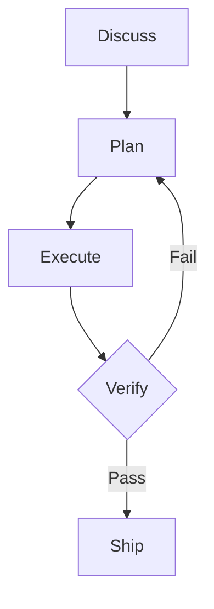

# Mermaid Diagram Authoring

Slim authoring guidance for Mermaid diagrams used in skill outputs. Adapted from the author's `utility-mermaid-diagrams` skill in a private upstream library (Apache 2.0, same author).

This reference is loaded by skills that produce documents with optional diagrams (`plab-guide`, `plab-strategy-brief`, future others). It covers the load-bearing 50 lines: when to use a diagram, which type fits which need, syntax validity rules, quality checklist.

## The Cardinal Rule

> Don't diagram what a list can say.

Diagrams earn their place when they reveal **relationships**, **branching**, or **flow** that prose flattens. Before creating any diagram, ask:

> Does this show branching, relationships, or flow that a list or table would flatten?

- **Yes** → proceed with a diagram
- **No** → use a numbered list, bullet list, or table instead

A 5-step linear process is a list. A 5-step process with two decision points and a retry loop is a diagram.

## Diagram Selection Guide

| I need to show... | Use | Also consider |
|-------------------|-----|---------------|
| A decision or approval process | Flowchart | State |
| Multi-service or multi-party interactions | Sequence | Flowchart |
| Feature lifecycle or status transitions | State | Flowchart |
| Work stages or pipeline status | Kanban | State |
| Release or sprint timeline with dependencies | Gantt | Timeline |
| Version history or chronological milestones | Timeline | Gantt |
| 2D prioritization (effort/impact, risk/value) | Quadrant | (none) |
| Allocation breakdown or composition | Pie | Treemap |
| Problem decomposition or brainstorming | Mindmap | (none) |
| Domain models or data relationships | ER | Class |
| API or object contracts | Class | ER |
| System topology or infrastructure | Architecture | Flowchart |
| Flow quantities or budget allocation | Sankey | Pie |
| Hierarchical proportional data | Treemap | Pie |
| Trends or time-series metrics | XY-Chart | (none) |

## Syntax Validity Principles

Six rules that prevent most rendering failures:

1. **Quote labels.** Any label containing spaces, parentheses, brackets, colons, commas, or reserved words must be quoted with double quotes.
2. **Escape special characters.** Characters with mermaid or markdown meaning (`>`, `<`, `-` at line start, `#`) need escaping or quoting.
3. **Declare before referencing.** Define a node before using it in an edge; referencing an undeclared node causes silent failures in some types.
4. **Respect limits.** Each diagram type has a maximum node/participant count beyond which readability collapses (typically 8-12 for most types).
5. **Comment your intent.** Use `%%` comments to document non-obvious choices (why this layout direction, why this grouping).
6. **Test before shipping.** Paste into a mermaid renderer (mermaid.live, VS Code preview, or your target environment) and verify it renders correctly.

## Quality Checklist

Before embedding a diagram in a skill output, verify:

- [ ] Diagram renders without error in the target environment
- [ ] Cardinal Rule satisfied: a list or table would not communicate this more clearly
- [ ] No linear sequences without branching, relationships, or hierarchy (those should be lists)
- [ ] All labels with spaces or special characters are properly quoted
- [ ] Special characters escaped where needed
- [ ] Node / participant count within type-specific limits (typically <= 8-12)
- [ ] Colors are accessible (WCAG AA 3:1 contrast minimum, black text on light backgrounds)
- [ ] Color is never the sole differentiator: shapes and labels also distinguish elements
- [ ] Diagram has a descriptive title or surrounding prose context
- [ ] `%%` comments document any non-obvious layout or grouping choices

## How skills consume Mermaid

Three rendering pathways exist depending on the artifact:

| Artifact | Mermaid renders via | Notes |
|----------|---------------------|-------|
| Markdown file (.md) | The viewer (GitHub, GitLab, VS Code, Obsidian, mkdocs+mermaid plugin) | Source survives as ` ```mermaid ` fenced block; rendering is the viewer's responsibility. Zero work for the producing skill. |
| HTML file | Pre-rendered to inline SVG via `mermaid-cli` (mmdc) | Skills that produce HTML call [`lib/render-mermaid.py`](../lib/render-mermaid.py) to convert ` ```mermaid ` blocks (also `<pre><code class="language-mermaid">` and `<div class="mermaid">`) to inline `<svg>` before final output. Atomic in-place edit; degrades gracefully when `mmdc` is missing. First consumer: `plab-guide`. |
| PDF file | Same SVG, rendered by headless Chrome's `--print-to-pdf` from the HTML | Inherits the HTML pathway; no additional work. |

## Embedding pattern (markdown)

````

````

Place ` ```mermaid ` blocks anywhere a regular code fence would go. Surrounding prose should reference the diagram explicitly ("the flow above") rather than rely on visual proximity.

## When NOT to use a diagram

- The information is already in a numbered list and reads cleanly
- The relationship is between only 2 things (use prose)
- The audience is a screen-reader-only consumer (provide text alternative)
- The artifact is text-only (plain `.txt`) with no rendering pathway
- The diagram would have more than ~15 nodes (split into multiple smaller diagrams or restructure)

## Cross-reference

A fuller diagram catalog (15 types, with worked examples) exists in the author's private upstream library and may be ported into `references/diagram-catalog.md` in a future release if cross-skill demand justifies it.

For the rendering pipeline that turns these blocks into inline SVG inside HTML / PDF artifacts, see [`../lib/render-mermaid.py`](../lib/render-mermaid.py).
