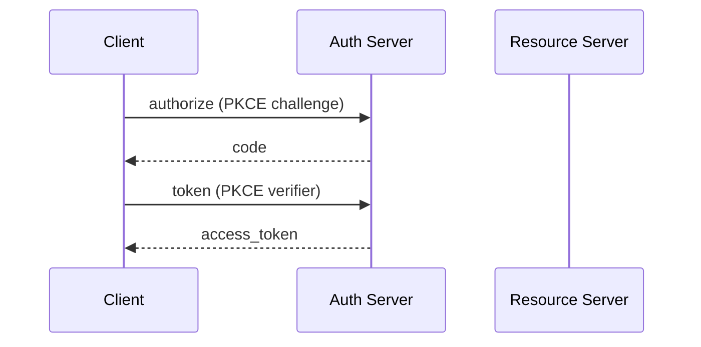

# ADHD Guide Structure Reference

The visual scaffolding rules for `<slug>_guide-adhd.md`. Locked baseline: `assets/templates/guide-template_adhd.md`.

## Use when

- Phase 5 (ADHD MD Fill)
- Auditing a draft for missing scaffolding
- Triaging "ADHD variant doesn't read differently than standard" complaints

## Relationship to standard variant

The ADHD variant carries **the same content** as the standard variant. What differs is the visual scaffolding optimized for skim, hop, and re-entry reading patterns. Both files satisfy the structural contracts of the standard variant (12 sections, mandatory order, 4-layer breakdown, etc.) plus the additional ADHD layering specified here.

Workflow: write the standard variant first (Phase 4), then in Phase 5 read the produced `<slug>_guide-standard.md` file and mechanically transform it into the ADHD form - keep the prose verbatim and layer on the scaffolding from the section-transformation table below. Do NOT regenerate the content from the outline or research; deriving from the finished standard MD guarantees content parity and is the cheaper path (~30-50% fewer tokens than regenerating).

## Required scaffolding

| Element | Rule |
|---------|------|
| Section numbering | Every H2 starts with a number using `.` separator: `## 1. At a Glance`, `## 5. 80/20 - High-Leverage Practices` |
| Sub-section numbering | `### 5.1. Trust the brainstorming pass`, `#### 8.3.1. Phase 1 - Pre-action skill check` |
| `[TL;DR]` callout | First content line of every section: `> **[TL;DR]** <one-sentence summary>` |
| `[BOTTOM LINE]` callout | Last content line of every section before Section confidence: `> **[BOTTOM LINE]** <one-sentence takeaway>` |
| `[QUICK NAV]` blocks | Sections with >=4 sub-sections get a clickable mini-TOC. Each entry is a markdown link to a heading anchor. |
| Inline tagged callouts | `> 📌 **[KEY]** ...`, `> 💡 **[INSIGHT]** ...`, `> ⚠️ **[WARNING]** ...`, `> ⚠️ **[GOTCHA]** ...`, `> ⏹️ **[STOP]** ...`, `> ⭐ **Pull quote:** "..."` |
| Section confidence emoji | `**Section confidence: high 🟢.**`, `medium 🟠`, `low 🔴` |
| Horizontal rules | `---` allowed **only before `##` (H2) section breaks**. Never between H3s, H4s, FAQ Q/A pairs, or sub-sections. |
| Paragraph length | Max 3 sentences per paragraph. Bold the load-bearing word. |
| Impact/Effort | Two-bullet list, not a 2-row table |
| Pull quotes | `> ⭐ **Pull quote:** "<quote>"` |

## Numbering rule (gate G-12)

Use `.` (dot) as the separator after the number, not `/` (slash):

| Wrong (`/`) | Right (`.`) |
|-------------|-------------|
| `## 1 / At a Glance` | `## 1. At a Glance` |
| `### 5.1 / Trust the brainstorming pass` | `### 5.1. Trust the brainstorming pass` |
| `#### 8.2.1 / The fourteen skills` | `#### 8.2.1. The fourteen skills` |

Why: `5 / 80/20` reads as a path or fraction. `5. 80/20` reads as a numbered section.

## Horizontal rule rule (gate G-13)

`---` only before `##` (H2). Never between H3s, H4s, FAQ Q/As, or sub-sections.

| Where | Allowed? |
|-------|---------|
| Before `## 5. 80/20 ...` | ✅ Yes |
| Before `### 5.1. ...` | ❌ No |
| Before `#### 8.3.1. Phase 1 ...` | ❌ No |
| Between `**Q: ...**` / `A: ...` Q/A pairs in the FAQ | ❌ No |
| Between consecutive `#### 8.4.N. ...` Expert Layer points | ❌ No |

The heading itself is the visual break. Adding rules between minor sections adds noise.

## QUICK NAV clickability (gate G-14)

`[QUICK NAV]` blocks must use markdown anchor links, not plain text bullets.

| Wrong (plain text) | Right (clickable) |
|-------------------|-------------------|
| `> - 5.1 / Trust the brainstorming pass` | `> - [5.1. Trust the brainstorming pass](#51-trust-the-brainstorming-pass)` |

GitHub-flavored markdown anchor format:
1. Lowercase
2. Periods, slashes, parens removed
3. Spaces and `-` -> `-` (single)

Example: heading `### 5.1. Trust the brainstorming pass, even when the request seems clear` -> anchor `#51-trust-the-brainstorming-pass-even-when-the-request-seems-clear`.

Quick nav blocks are required for sections >=4 sub-sections: 5 (80/20), 8 (In-Depth Breakdown), 8.3 (Mechanical phases), 8.4 (Expert points), 9 (FAQ).

## Callout tag glossary

| Tag | Emoji | Use for |
|-----|-------|---------|
| `[TL;DR]` | none | One-sentence summary at top of section |
| `[BOTTOM LINE]` | none | One-sentence takeaway at end of section |
| `[QUICK NAV]` | none | Clickable mini-TOC for sections with >=4 sub-sections |
| `[ACTION]` | none | Specific thing the reader should do |
| `[DIAGRAM]` | none | Marks a Mermaid diagram block in the ADHD variant; helps skim-readers find visuals fast |
| `[KEY]` | 📌 | The single most important point in the section |
| `[INSIGHT]` | 💡 | Non-obvious thing worth pausing on |
| `[WARNING]` | ⚠️ | Common mistake or gotcha to avoid |
| `[GOTCHA]` | ⚠️ | Edge case or trap (same emoji as WARNING; the tag distinguishes) |
| `[STOP]` | ⏹️ | Do not do this (rare; use only for hard-stop rules) |
| Pull quote | ⭐ | Inline emphasis on a starred takeaway |

**Emoji rule:** every callout that "warns / informs / pins" gets one of the five emojis. Don't double up (no `📌 💡 [KEY]`). Don't put emojis on `[TL;DR]`, `[BOTTOM LINE]`, `[QUICK NAV]`, or `[ACTION]` - they already read as structural.

## Section confidence emoji

Every `**Section confidence: <level>.**` line ends with the matching emoji:

| Level | Emoji |
|-------|-------|
| high | 🟢 |
| medium | 🟠 |
| low | 🔴 |

```markdown
**Section confidence: medium 🟠.** Mix of sourced and inferred claims.
```

## Impact/Effort presentation

In Section 5 (80/20), Impact and Effort render as a two-bullet list, not a 2-row table:

```markdown
### 5.1. Trust the brainstorming pass

> **[ACTION]** Let the `brainstorming` skill fire on every non-trivial request.

The brainstorming skill is the cheapest place to catch design errors [S1].

- **Impact:** prevents "I built the wrong thing" failures.
- **Effort:** trivial (automatic if you let it fire).
```

Gate G-15 bans 2-row tables anywhere.

## Diagram scaffolding ([DIAGRAM] marker)

When the standard variant embeds a Mermaid diagram (see `guide-structure-standard.md` § 8 In-Depth Breakdown for placement rules), the ADHD variant carries the same diagram preceded by a `[DIAGRAM]` callout so a skim-reader can find it without reading the prose:

````markdown
> **[DIAGRAM]** Auth handshake across client / auth server / resource server.


````

Rules:
- `[DIAGRAM]` callout immediately precedes the fenced ` ```mermaid ` block. One sentence describing what the diagram shows.
- Same Cardinal Rule as the standard variant: don't diagram what a list can say. See `../../references/diagrams.md`.
- The fenced block survives untouched into the ADHD `.md` file; markdown viewers (GitHub, Obsidian) render it natively.
- The HTML pipeline does NOT use the ADHD MD as a source; quick-ref HTML diagrams are authored separately in Phase 6 and pre-rendered in Phase 6.5.

## Mechanical Layer prose density (gate G-2 enforces)

In the ADHD variant, every Mechanical Layer phase (`#### 8.3.N. Phase N - <name>`) gets:
- A `📌 **[KEY]** ...` callout (one sentence)
- 2-4 paragraphs of prose covering: trigger, internal steps, artifact, why

One-sentence phases were explicitly flagged in v1.0.0 review as too sparse. Fold any genuinely-one-sentence phase into an adjacent phase.

## Section transformation table

| Standard variant | ADHD variant |
|------------------|--------------|
| `## At a Glance` | `## 1. At a Glance` + `[TL;DR]` + `[BOTTOM LINE]` + `🟢` |
| `## In-Depth Breakdown` | `## 8. In-Depth Breakdown` + `[QUICK NAV]` (clickable) |
| `### Surface Layer - What It Is` | `### 8.1. Surface Layer - What It Is` + `[TL;DR]` + `[BOTTOM LINE]` |
| `#### Phase 6 - TDD inside each task` | `#### 8.3.6. Phase 6 - TDD inside each task` + `📌 **[KEY]** ...` |
| `**Section confidence: high.**` | `**Section confidence: high 🟢.**` |

## Anti-patterns

| Anti-pattern | Symptom | Fix |
|-------------|---------|-----|
| `/` after number | `## 5 / 80/20 ...` | Replace with `.` (gate G-12) |
| `---` between H3s | Visual noise | Remove (gate G-13) |
| Plain-text QUICK NAV | Bullets not clickable | Convert to markdown links (gate G-14) |
| 2-row Impact/Effort table | Hard to scan | Use bullets (gate G-15) |
| One-sentence Mechanical phase | Sparse | Expand to 2-4 paragraphs |
| Emoji-tagged `[TL;DR]` | Over-saturated | Drop the emoji on structural tags |
| Section confidence with no emoji | Inconsistent with rest | Add 🟢 / 🟠 / 🔴 |
| Em-dashes anywhere | LLM-default | Pre-write sweep replaces (gate G-11) |
| Mermaid block without `[DIAGRAM]` callout | Skim-reader misses the visual | Prepend `> **[DIAGRAM]** <one-sentence description>` |
| Diagram of a 2-step process | Diagram earns nothing over a list | Convert to step-row or numbered list (Cardinal Rule from `../../references/diagrams.md`) |
