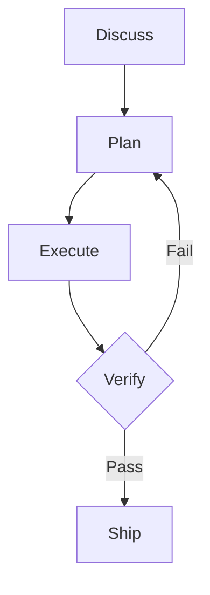

# Standard Guide Structure Reference

The 12-section IA contract for `<slug>_guide-standard.md`. Locked baseline: `assets/templates/guide-template_standard.md`.

## Use when

- Phase 4 (Standard MD Fill)
- Auditing a draft for missing sections or wrong order
- Triaging "the guide reads like a generic LLM summary" complaints

## Section list (mandatory order)

| # | Section | H2 heading | Length |
|---|---------|-----------|--------|
| 1 | At a Glance | `## At a Glance` | 8-12 row Field/Value table; no prose |
| 2 | Table of Contents | `## Table of Contents` | Auto-generated; links to every H2 + key H3 |
| 3 | Executive Summary | `## Executive Summary` | 250-500 words + Key Takeaways callout. Written LAST. |
| 4 | Official Resources | `## Official Resources` | 5-15 row Resource/URL/Use-for table; official sources only |
| 5 | 80/20 - High-Leverage Practices | `## 80/20 - High-Leverage Practices` | 5-7 numbered practices, each with prose + Impact/Effort BULLETS |
| 6 | Getting Started | `## Getting Started` | Mental model + first concrete step + first-session expectations |
| 7 | Key Terms | `## Key Terms` | 8-20 row Term/Definition table |
| 8 | In-Depth Breakdown | `## In-Depth Breakdown` | Heart of the document. 4 progressive-disclosure layers. |
| 9 | Frequently Asked Questions | `## Frequently Asked Questions` | >=3 categories, >=8 Q/A |
| 10 | Similar Tools & Alternatives | `## Similar Tools & Alternatives` | Comparison table + when-to-choose + when-overkill |
| 11 | Additional & Third-Party Resources | `## Additional & Third-Party Resources` | 4 sub-sections (Official, Community, Deep-Dive, Related); >=5 links |
| 12 | Sources & Evidence | `## Sources & Evidence` | Primary sources, confidence markers, unverified claims, traceability, gaps |

The order is non-negotiable. Gate G-1 fails the run if any section is missing or out of order.

## Frontmatter

```yaml
---
title: <Topic> - Guide
slug: <slug>
type: explanatory
generated: <YYYY-MM-DD>
last-verified: <YYYY-MM-DD>
source-count: <n>
confidence: high | medium | low-confidence draft
audience: <one-line audience description>
maturity: experimental | active development | stable v1.x | maintenance | deprecated
license: <SPDX or "proprietary" or "n/a">
---
```

All 10 fields populated. `last-verified` is the same as `generated` on first run; updated when the operator re-validates citations.

## Status banner (conditional)

If `confidence != high`, insert immediately after the H1:

```markdown
> **Status:** medium-confidence draft. <One-sentence honest reason>. See Sources & Evidence for the per-section breakdown.
```

The banner text adapts to the actual confidence level. The literal phrase "low-confidence draft" is reserved for `confidence: low-confidence draft` in frontmatter (no fetched sources or all class C).

## Section-by-section guidance

### 1. At a Glance

8-12 row Field/Value table. The most-read section. Make every row count. No prose; just the table.

Common rows: What, Category, Who built it, License, Source, Cross-platform/Distribution, Audience, Cost, Maturity, Stance.

### 2. Table of Contents

Auto-generated bullet list of all H2 headings plus key H3 headings under In-Depth Breakdown and FAQ. Generated last (alongside Exec Summary).

### 3. Executive Summary

3-6 paragraphs. **Written last**, after the body is complete. Summarizes the actual document, not the intended document.

Structure:
- Paragraph 1: What the topic is, who built it, the headline framing
- Paragraph 2: The structural innovation or core mechanic
- Paragraph 3: The failure modes addressed or problem space
- Paragraph 4: Practical operator impact
- Followed by: Key Takeaways callout (5 numbered bullets)
- Followed by: Section confidence line

### 4. Official Resources

5-15 row table: Resource | URL | Use for. **Official sources only.** Community goes to Section 11.

For a repo-url topic, typical rows: Source repo, Documentation site, Package registry, Issue tracker, Discord/Slack, Per-platform docs, Related products.

### 5. 80/20 - High-Leverage Practices

5-7 numbered practices. Each practice = 1-3 sentences explaining what to do and why + Impact/Effort BULLETS:

```markdown
### 1. <Practice phrased as an imperative>

<1-3 sentences explaining what to do and why it works. Cite primary source.>

- **Impact:** <what failure mode this prevents or what gain this captures>.
- **Effort:** <trivial / marginal / moderate / heavy>.
```

End the section with a "Key insight" pull quote synthesizing the practices.

**Anti-pattern:** Impact and Effort on one line. Use bullets. Gate G-15 also bans 2-row tables.

### 6. Getting Started

Three sub-sections in this order:
1. **Mental Model** - 1-2 sentences capturing the topic's core conceptual move
2. **First Concrete Step** - the runnable command or the minimum viable mental model (for concepts)
3. **First-Session Expectations** - 4-row #/Expectation table

### 7. Key Terms

8-20 row Term | Definition table. Topic-specific vocabulary. Skip terms any reader already knows ("Git is a version control system").

Mark inferred terms: `**worktree** | A separate working directory ... [inferred, standard Git terminology].`

### 8. In-Depth Breakdown

The heart of the document. See `references/progressive-disclosure.md` for the 4-layer model.

H2 heading: `## In-Depth Breakdown`. Four H3 sub-headings, in this fixed order. Heading **labels** can be canonical (default for software) or topic-specific (recommended for non-software topics):

- Canonical: `### Surface Layer - What It Is` / `### Structural Layer - How It's Organized` / `### Mechanical Layer - How It Works` / `### Expert Layer - What's Non-Obvious`
- Topic-specific (e.g., for OKRs): `### What OKRs Are` / `### The Anatomy of an OKR` / `### Running an OKR Cycle in Practice` / `### Common Misuses and Subtleties`

The four layers' **logic** is mandatory; the **labels** are flexible. See `references/progressive-disclosure.md` for the rule and patterns.

**Diagrams (optional).** When a layer reveals **branching**, **relationships**, or **flow** that prose flattens, embed a Mermaid diagram inside a fenced code block. Markdown viewers (GitHub, Obsidian, mkdocs+mermaid) render them natively. Skip diagrams for linear sequences (a numbered list reads better) and for two-party interactions (prose suffices). For diagram authoring discipline (Cardinal Rule, type selection, syntax validity), see [`../../references/diagrams.md`](../../../../references/diagrams.md). Common fits per layer:

| Layer | Diagram opportunities |
|-------|----------------------|
| Surface | Architecture overview (Architecture diagram); concept map (Mindmap) |
| Structural | Component / module relationships (Class or ER); request lifecycle (Flowchart or Sequence) |
| Mechanical | State machines (State); multi-party protocols (Sequence); decision flow (Flowchart) |
| Expert | Edge-case decision tree (Flowchart); failure-mode classification (Quadrant or Mindmap) |

Embed pattern:

````markdown

````

Surrounding prose should reference the diagram explicitly ("the flow above") rather than rely on visual proximity.

### 9. Frequently Asked Questions

See `references/faq-generation.md`. >=3 categories, >=8 Q/A pairs.

### 10. Similar Tools & Alternatives

Comparison table + two bullet lists (when-to-choose / when-overkill).

| Approach | What it is | Best for | Trade-off vs. <topic> |
|----------|-----------|----------|----------------------|

### 11. Additional & Third-Party Resources

Four sub-sections in order: Official, Community & Tutorials, Deep-Dive / Advanced, Related Tools. Each is a bullet list with `<resource> / <description> [S<n>]` format.

### 12. Sources & Evidence

Five sub-sections:
1. **Primary Sources** - numbered `[S<n>]` list with retrieval date and credibility
2. **Confidence Markers Used** - the marker glossary (`[S1]`, `[inferred]`, `[unverified]`, section confidence levels)
3. **Unverified Claims** - table: Claim | Where it appears | Why it's unverified
4. **Source-to-Section Traceability** - table mapping each section to its primary sources + inferred/unverified count
5. **Gaps** - table: Gap | Where to look (topics adjacent to this guide that the available sources didn't cover)

## Per-section section confidence

Every major section ends with one line:

```markdown
**Section confidence: high.** <One-line justification.>
```

Levels: `high` (all claims directly sourced), `medium` (mix of sourced + inferred), `low` (mostly speculative).

## Topic-type adapters

The structure is the same across input types; the content adapts:

| Section | repo-url adaptation | tool adaptation | concept adaptation |
|---------|---------------------|----------------|-------------------|
| At a Glance | Repo URL, license, maintainer | Package + version + install | Origin (paper/spec) + adjacent concepts |
| Getting Started > First Step | `pip install <pkg>` etc. | `<tool> --help` | Mental model paragraph instead of command |
| Official Resources | Repo, docs, issues, Discord | Docs, PyPI, repo | Originating paper, RFC, well-known explainers |
| Similar Tools | Other plugins in same category | Adjacent tools | Adjacent concepts and sub-concepts |

## Length targets

Total document: 1,500-6,000 words. Target 3,500-5,500 for a high-confidence guide.

The two locked references converged at:
- `superpowers_guide-standard.md`: ~5,750 words
- `memsearch_guide-standard.md`: ~5,400 words

Both are repo-url topics with substantial documentation.

## Anti-patterns

| Anti-pattern | Fix |
|-------------|-----|
| Section out of order | Re-arrange to match the canonical order; gate G-1 enforces |
| Missing section | Add it (even if content is sparse) |
| Empty section | Either populate or merge with adjacent section |
| Exec Summary written first | Defer to last; it's a summary of the actual body |
| Impact/Effort inline | Convert to bullet list (gate G-15) |
| 2-row table anywhere | Convert to bullet list (gate G-15) |
| Header-less 2-column "Field/Value" table | Add column headers (gate G-16) |
| Em-dashes in body | Pre-write sweep (gate G-11) replaces them |
| Diagram of a linear sequence | Convert to numbered list (Cardinal Rule from `../../references/diagrams.md`: don't diagram what a list can say) |
| Mermaid block with unquoted special characters | Quote labels containing spaces, parentheses, colons, or `>` (Syntax Validity Principle 1 in `../../references/diagrams.md`) |
