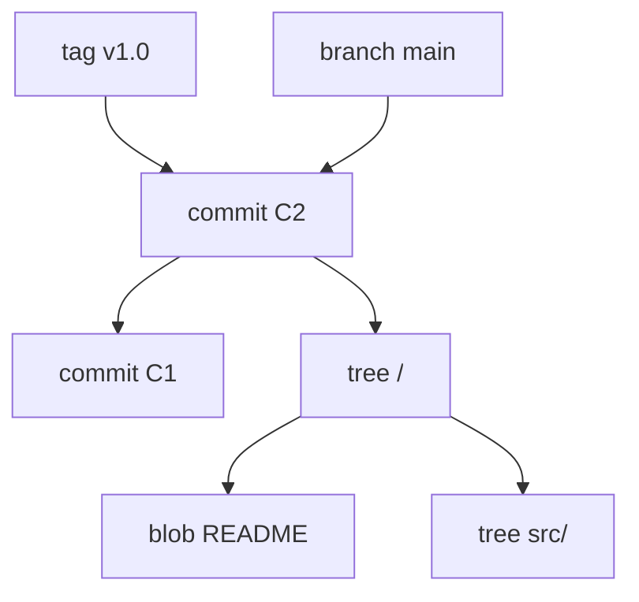
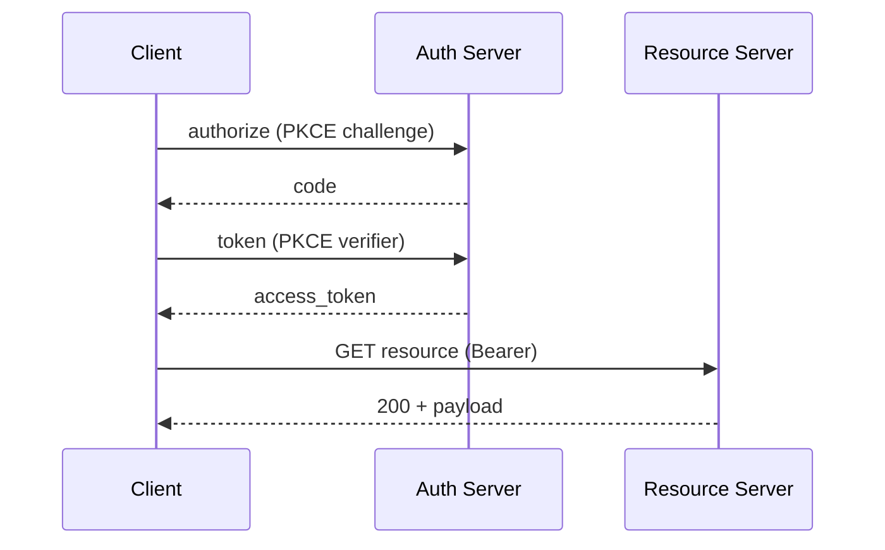

# Quick-Reference HTML Patterns Reference

The card catalog and layout rules for `<slug>_quick-reference.html`. Locked baseline: `assets/templates/quick-reference-template_v1-technical-white.html`.

For visual style edits (fonts, colors, sizes, fills), see [`quick-ref-theme.md`](quick-ref-theme.md). This file covers what cards to put where; that one covers what they look like.

## Use when

- Phase 6 (Quick-Reference HTML Fill)
- Auditing a draft for missing or off-brand cards
- Triaging "PDF rendered 3 pages" overflow

## Layout fundamentals (v1.5.0 baseline)

| Property | Value |
|----------|-------|
| Page size | US Letter (`@page { size: letter; margin: 0.3in 0.4in; }`) |
| Body font | "Segoe UI", "Helvetica Neue", Arial, sans-serif |
| Mono font | Consolas, "Courier New", monospace |
| Body font size | **6.75pt** (v1.5.0; was 8pt in v1.0.0-v1.4.0) |
| Body weight | **500** (medium; via `--weight-body`; was 400 / regular) |
| Body color | **`#000000`** pure black (was `#0e131c` dark-gray pre-v1.5.0) |
| Body line-height | **1.22** (was 1.32) |
| Card padding | **`3px 5px 3px 5px`** (was `5px 8px`) |
| Grid gap | **3px** (was 5px) |
| Layout | CSS Columns: `column-count: 2; column-gap: 3px; column-fill: balance;` |
| Default card width | single column (half page) |
| Full-width cards | `.span-6` uses `column-span: all` to break out across both columns |
| Deprecated card classes | `.span-2`, `.span-3`, `.span-4` are no-ops in column layout (only "single column" or "all columns" are meaningful) |
| Semantic backgrounds | `.card.ref` (left accent rule, lookup tables), `.card.summary` (top accent rule, closing banner) |
| Diagram cards | `.card.diagram` (vertical, max-height 1.8in) or `.card.diagram.span-6` (horizontal, max-height 2.2in) |
| Accent color | Blue `#1f4b87` |

These values are calibrated against the Spike H reference render of `git-concepts-2026-05-07` (page 1 = 0.385, page 2 = 0.348 ink ratio; canonical v1.5.0 reference output). Adjust only if a real overflow problem persists after card-level fixes.

## Density target (v1.5.0; hard floor in v1.5.2)

Author **18-20 cards / ~12-13k chars body content** for a 2-page bundle. Pages should land at **>= 0.30 ink ratio per page** (recommended target; G-8 floor remains 0.20).

**v1.5.2 hard floor (G-19): the produced HTML must have at least 11,000 visible body characters.** `scripts/measure-html-body-chars.py` runs from `render-pdf.sh` before Chrome and aborts the build with exit code 5 if the body is too thin. Calibration evidence:

| Bundle | Body chars | Status |
|--------|-----------|--------|
| Original git-concepts (v1.4.0 baseline) | 6,671 | FAIL (would be blocked under G-19) |
| codex/ai-coding-cli-trio (sparse 2026-05-08) | 8,837 | FAIL (was passing G-8 at 0.30 but feeling sparse) |
| Spike H git-concepts (canonical v1.5.0) | 12,144 | PASS |
| Locked template sample render | ~5,500 | EXEMPT (pattern catalog, not a produced guide) |

The 11,000 threshold is calibrated 1k below the Phase 6 lower-bound target (12k) and well above the failing-but-passing-G-8 codex case (8.8k). Topics that genuinely cannot fill 11k chars are rare; if you encounter one, expand the topic's depth (more anti-patterns, more vocabulary, more recipes, more diagrams) rather than relaxing the floor.

Rough character capacity at the v1.5.0 baseline:
- 2 columns x ~890px column height (Letter, after masthead + lede)
- Body 6.75pt at line-height 1.22 -> ~11px per line
- ~56 chars per line in a single column (after card padding)
- Net capacity: ~2 x (890 / 11) x 56 = **~9k chars per page**, **~18k chars per 2-page bundle**

Target: fill ~70% of capacity (~12-13k chars) so density lands at 0.30+ without leaving zero whitespace. Authoring more than 13k chars typically overflows; less than 10k chars typically under-fills.

### Why CSS Columns instead of Grid

CSS Grid's default `align-items: stretch` forces both cards in a row to share the taller card's height. When the left card is shorter than the right, the empty bottom of the left card is wasted vertical space inside that card. The user sees a card with prose ending mid-card and significant white space below.

CSS Columns flow each card to its natural content height, then continue the next card below it (in the same column) or in the next column (when the column is full). No row alignment, no stretch waste.

**Trade-off in reading order.** Grid layout is row-major: read across, then down. Columns are column-major: down the left, then down the right. For reference cards where each card is independent, column-major works fine. For narrative content where order matters, columns would be wrong (but quick-ref content is the former).

## Page composition

Two pages, each with masthead + card grid, plus a footer band at the very end.

### Page 1: orientation + architecture

Reader has just landed on the topic. Goal: orient them and show the architecture.

Typical card sequence:
1. Lede paragraph (one paragraph, bold load-bearing phrase)
2. Workflow / Pipeline (steps the topic runs end-to-end)
3. Skills / Concepts / Components (the named pieces)
4. Plugins / Hosts / Integrations (where the topic plugs in)
5. Architecture / Data Model
6. Search / Query mechanics (if applicable)
7. Backends / Storage (if applicable)
8. `span-6 .summary` closing card (the one big idea)

### Page 2: install + recipes + reference

Reader is ready to do something with the topic. Goal: give them install paths and operational reference.

Typical card sequence:
1. Install per host (one card per host group)
2. CLI cheat sheet
3. Programmatic API (Python / library / etc.)
4. Use cases (when to recall, when to use)
5. Anti-patterns
6. Settings / Configuration
7. See Also (links + license + author)

## Card types

| Card type | Purpose | Typical span | Background |
|-----------|---------|--------------|-----------|
| Workflow | Numbered step-row list of pipeline phases | span-3 | white |
| Concept | H3-grouped concept blurbs | span-3 | white |
| Architecture | Table or step-row diagram | span-3 | white |
| Reference / lookup | Tables of facts (commands, flags, terms) | span-3 | `.card.ref` |
| Recipe | Code block + explanation | span-3 | white |
| Diagram (vertical) | Mermaid pre-rendered to inline SVG; portrait aspect | span-3 | `.card.diagram` |
| Diagram (horizontal, v1.5.0+) | Mermaid pre-rendered to inline SVG; landscape aspect | span-6 | `.card.diagram.span-6` |
| Glossary (v1.5.0+) | Term/def table for vocabulary used across cards | span-3 | `.card.ref` |
| Anti-patterns | Don't / Why table | span-3 | `.card.ref` |
| Closing summary | Full-width banner | span-6 | `.card.summary` |
| See Also | Links + license | span-3 | `.card.ref` |

`.card.ref` is for lookup-shaped content (operators reach for it later). `.card.summary` is for the closing banner that ties Page 1 together.

## Card pattern catalog

### Step-row card (workflow / numbered list)

```html
<div class="card span-3">
  <h2>Capture Pipeline <span class="tag">per turn</span></h2>
  <div class="step-row"><span class="n">1.</span><span class="b"><strong>Stop hook fires</strong> after each agent turn.</span></div>
  <div class="step-row"><span class="n">2.</span><span class="b"><strong>Parse last turn</strong>.</span></div>
  ...
</div>
```

Use for ordered sequences (workflow phases, recipe steps). Bold the load-bearing word in each row.

### Concept card (H3 + paragraph blurbs)

```html
<div class="card span-3">
  <h2>Plugins / Hosts <span class="tag">5 paths</span></h2>
  <h3>Claude Code</h3>
  <p>Stop hook + summarizer. <code>/memory-recall</code>.</p>
  <h3>Codex CLI</h3>
  <p>Codex hooks summarize. <code>$memory-recall</code>.</p>
</div>
```

Use for grouped concepts where each gets a label and a 1-2 sentence explanation.

### Reference table card

```html
<div class="card span-3 ref">
  <h2>Backends <span class="tag">milvus.uri</span></h2>
  <table>
    <tr><th>Mode</th><th>URI / Setup</th></tr>
    <tr><td>Milvus Lite</td><td>Default. <code>~/.memsearch/milvus.db</code>.</td></tr>
    ...
  </table>
</div>
```

Use for lookup tables. The `.ref` background flags it as reference content. Headers required (gate G-16).

### Code recipe card

```html
<div class="card span-3">
  <h2>Install <span class="tag">claude / codex / openclaw / opencode</span></h2>
  <h3>Claude Code</h3>
<pre>/plugin marketplace add <span class="k">zilliztech/memsearch</span>
/plugin install <span class="k">memsearch</span></pre>
  <h3>Codex CLI</h3>
<pre>git clone --depth 1 <span class="k">https://...</span></pre>
</div>
```

Use for command sequences. Wrap variable identifiers in `<span class="k">` (highlight) or comments in `<span class="c">`.

### Diagram card (Mermaid pre-rendered to SVG)

**Aspect-ratio rule (v1.5.0):** match the card class to the diagram's natural aspect ratio.

- **Vertical / portrait diagrams** (taller than wide) -> `.card.diagram` (single column). Max-height 1.8in. Examples: stateDiagram, top-down flowcharts, sequence diagrams with 3-4 participants, simple decision trees.
- **Horizontal / landscape diagrams** (wider than tall) -> `.card.diagram.span-6` (full row across both columns). Max-height 2.2in. Examples: pipeline flowcharts (`flowchart LR`), sequence diagrams with 5+ participants, ER diagrams, timeline diagrams.

Vertical example:

```html
<div class="card span-3 diagram">
  <h2>Object Graph <span class="tag">composition</span></h2>

  <div class="when"><b>When:</b> top-down structural relationships, hierarchical composition.</div>
</div>
```

Horizontal example (v1.5.0+):

```html
<div class="card span-6 diagram">
  <h2>Auth Flow <span class="tag">sequence</span></h2>

  <div class="when"><b>When:</b> ordered interactions across 3+ parties; full-row width gives readable label spacing.</div>
</div>
```

The Mermaid source above is replaced in place by an inline `<svg>` element during Phase 6.5 (`lib/render-mermaid.py`). `.card.diagram` caps the SVG at `max-height: 1.8in`; `.card.diagram.span-6` raises that cap to `2.2in` so wider horizontal diagrams use their extra width without forcing a tiny render.

Three source shapes are recognised by the renderer (use the fenced form unless you have a reason not to):

1. ` ```mermaid `…` ``` ` markdown fenced block (recommended - matches the Standard MD)
2. `<pre><code class="language-mermaid">...</code></pre>` (GitHub-flavored HTML form)
3. `<div class="mermaid">...</div>` (Mermaid's native init container)

All three are detected by Gate G-18; a surviving block in the final HTML means the toolchain failed and the bundle is rejected.

### Closing summary banner

```html
<div class="card span-6 summary">
  <h2>Markdown-as-Source-of-Truth <span class="tag">design contract</span></h2>
  <p>Memories are <code>.md</code> files. Milvus is a derived, rebuildable cache. <strong>If Milvus dies:</strong> ...</p>
</div>
```

Use as the closing card on Page 1. `span-6` makes it full-width; `.summary` background gives it weight.

## Topic adaptation

The card catalog is a **menu**, not a template. Pick the cards that apply to the topic and discard the rest.

| Topic type | Common Page 1 cards | Common Page 2 cards |
|------------|--------------------|--------------------|
| repo-url (plugin) | Workflow, Concepts, Hosts, Architecture, Closing summary | Install, CLI/API, Use cases, Anti-patterns, See Also |
| tool (CLI) | Quick reference of subcommands, Common flags, Architecture | Install, Examples, Recipes, Pitfalls, See Also |
| concept | Mental model, Sub-concepts, Relationships, Visual diagram | Application, Adjacent concepts, Misconceptions, See Also |

## Forbidden content

| Forbidden | Why |
|-----------|-----|
| Marketing prose | Operator card is reference, not pitch |
| Long paragraphs (>3 sentences) inside cards | Cards are scannable; long prose belongs in the MD guide |
| Em-dashes / en-dashes | Voice rule (gate G-11) |
| 2-row tables | Use a list (gate G-15) |
| Header-less 2-col Field/Value tables | Always include column headers (gate G-16) |
| Installation walkthroughs | If it's a multi-paragraph install guide, link to the MD guide instead |

## Page-fit math

Each page is ~990px tall (US Letter, 0.3in/0.4in margins, 96 DPI). Subtracting:
- Masthead: ~30px + 4px margin = ~34px (v1.5.0; was ~58px in v1.0.0-v1.4.0)
- Footer (page 2 only): ~35px + 7px margin = ~42px

Available content area:
- Page 1: ~956px
- Page 2: ~914px (footer takes ~42px)

In the v1.3.0 column layout, content flows into 2 columns of ~956px (or ~914px) tall each. Total content area per page = ~2 × 935px ≈ 1870px-equivalent. Cards consume their natural height; total card heights must fit within `2 × column-height` across both columns.

A `.span-6` card breaks the column flow horizontally and consumes its single full-width row from the column-height budget.

If the longest card overflows, the page count grows. The fix order for **overflow** (PDF rendered 3+ pages), in increasing pain:
1. Trim a low-value card entirely (a 21-card bundle that overflows often lands at 2 pages with 19-20 cards)
2. Tighten the longest card (drop a row, shorten a heading, condense prose)
3. Reduce card padding by 1px (`3px 5px` -> `2px 4px`)
4. Reduce grid gap by 1px (`gap: 3px` -> `gap: 2px`)
5. Trim masthead margin-bottom (`4px` -> `2px`)

The fix order for **under-fill** (page below 0.30 target ink ratio, or whole document collapses to 1 page), in order of value:
1. Add cards from the catalog. Common additions: glossary, decision matrix, comparison table, edge-case grid, anti-patterns, recovery cookbook, inspecting-state.
2. Expand short cards. More rows in step-row cards, more H3 blurbs in concept cards, more anti-pattern rows.
3. Promote a `span-3` card to `span-6` if the content earns full width (or if it's a horizontal diagram).
4. Rebalance: move a card from over-stuffed page 1 to thin page 2.
5. Revisit research. Surface caveats, gotchas, common mistakes, edge cases not yet captured.

Density target (v1.5.0): each page should land at **>= 0.30 ink ratio** (recommended target). Below 0.20 the render script (`scripts/render-pdf.sh`) fails with exit code 4. The contract is "exactly 2 pages, both densely filled" - sparse pages are as much a failure as overflow. Spike H reference benchmark: 0.385 / 0.348.

## Gate enforcement

| Gate | Check |
|------|-------|
| G-7 | No banned content (install walkthroughs, "what is X" entries, marketing prose) |
| G-8 | PDF renders at exactly 2 pages AND each page has ink ratio >= 0.20 (pixel-based density via `pdftoppm`; v1.5.0 recommended target >= 0.30; Spike H benchmark 0.385 / 0.348) |
| G-11 | No em-dashes / en-dashes |
| G-15 | No 2-row tables (use a list) |
| G-16 | All tables have column headers |
| G-17 | Quick-ref HTML uses the locked template (`:root --accent`, `--font-body`, `class="masthead"`, `class="grid"`, `class="card"`) |
| G-18 | No surviving Mermaid source blocks after Phase 6.5 (verified by `validate-no-mermaid-fences.py`) |
| G-19 | HTML has at least 11,000 visible body characters (v1.5.2+; verified by `measure-html-body-chars.py` BEFORE Chrome runs; fails fast on under-authored HTML; locked template exempt) |

## Anti-patterns

| Anti-pattern | Symptom | Fix |
|-------------|---------|-----|
| Page 1 has install + Page 2 has install | Duplication | Move all install cards to Page 2 |
| Tables without headers | Field/Value pairs without `<th>` | Add `<tr><th>...</th></tr>` |
| Card with one short row | Wasted real estate | Merge with adjacent card or expand |
| Page 2 ends with white space | Sparse page (G-8 density floor failure) | Add cards from the catalog; expand short cards; rebalance from page 1 |
| Whole document fits on 1 page | Severe under-fill (G-8 page-count floor failure) | Add 4-6 more cards; the topic likely warrants more depth than was captured |
| Long paragraph inside card | Hard to scan | Break into 2-3 short paragraphs or convert to bullets |
| Emoji-heavy lede | Doesn't render well in PDF | Stick to ASCII + the blue accent |
| Topic-irrelevant card | E.g., "API" card on a non-API topic | Drop it; pick from the catalog |
| Surviving ` ```mermaid ` block in final HTML | mmdc was missing or rendering failed silently | Install mmdc (`npm i -g @mermaid-js/mermaid-cli`); re-run Phase 6.5; G-18 catches this |
| Diagram overflows card height | SVG is taller than 1.8in cap or the diagram has too many nodes | Reduce node count (target <= 8-12); split into two smaller diagrams; verify `.card.diagram` class is applied |
| Linear sequence drawn as a flowchart | Diagram adds no information over a numbered list | Convert to step-row card (Cardinal Rule from `references/diagrams.md`) |
